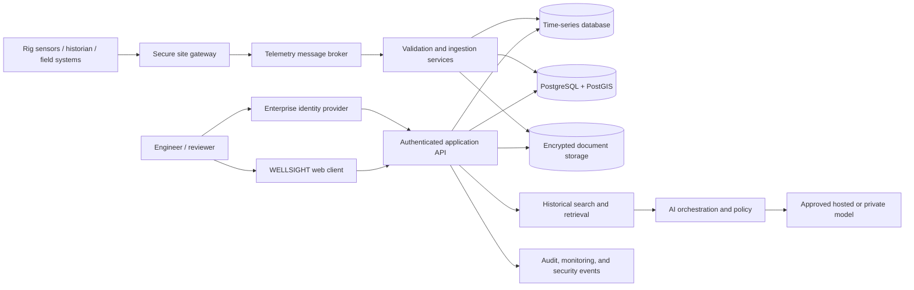

# WELLSIGHT

**An intelligent well operations workspace for drilling teams.**

WELLSIGHT brings well monitoring, offset-well context, historical knowledge, risk evidence, alerts, engineering reports, and AI-assisted analysis into one operational experience. It is designed to help engineers move from incoming measurements and field records to traceable context and informed review.

## Product vision

Drilling decisions depend on information spread across rig systems, daily drilling reports, historical incidents, offset wells, and engineering expertise. WELLSIGHT unifies those sources in a well-centered workspace so teams can:

- Monitor drilling parameters and trends in a shared, real-time view.
- Compare nearby wells, formations, depths, and recorded events.
- Search historical cases and follow each insight back to its evidence.
- Review risk indicators with visible supporting records and context.
- Manage alerts and engineering follow-up in a consistent workflow.
- Prepare well reports and retain team review history.
- Ask the WELLSIGHT assistant questions grounded in authorized well data.

WELLSIGHT is an engineering decision-support system. Operational decisions remain under the control of qualified personnel and approved well programs.

## Platform capabilities

| Workspace | Route | Capability |
| --- | --- | --- |
| Overview | `/` | Well status, monitoring summary, active alerts, nearby wells, and shortcuts to engineering workflows. |
| Well Monitoring | `/live-well` | Sensor-channel dashboard, parameter cards, live trend charts, saved readings, and monitoring sections for drilling operations. |
| Nearby Wells | `/nearby-wells` | Interactive location map, offset filters, well records, event history, and comparison tools. |
| Well Correlation | `/correlation` | Compare formations, depths, parameter context, and historical events across selected wells. |
| Historical Knowledge | `/knowledge` | Search and filter incident records; inspect event details, evidence, source references, and case summaries. |
| Risk Intelligence | `/risk` | Review risk categories, event counts, historical matches, analytics, depth context, and evidence-backed alerts. |
| Alerts | `/alerts` | Prioritize, filter, review, acknowledge, and investigate well alerts. |
| Reports | `/reports` | Assemble active and offset well context, events, alerts, and engineer notes; print or export PDF, JSON, CSV, and Markdown. |
| Data Import | `/import` | Upload CSV, JSON, and searchable PDF files; map and validate event fields; approve or reject records. |
| Offset Intelligence | `/intelligence/offsets` | Explain the factors used to select and compare offset wells. |
| Historical Timeline | `/intelligence/timeline` | Review cases around a selected depth and compare event sequence. |
| Evidence Chain | `/intelligence/evidence` | Trace insights to their source records, passages, and provenance. |
| Data Quality | `/intelligence/quality` | Review record completeness, freshness, source type, and confidence context. |
| Engineer Feedback | `/intelligence/feedback` | Capture and retain engineering review of case relevance and missing context. |
| Case Fingerprint | `/intelligence/fingerprint` | Summarize comparable-case characteristics and visible factor matches. |
| Shadow Well | `/intelligence/shadow-well` | Explore offset location, formation, depth, and event context beside the active well. |
| Knowledge Graph | `/intelligence/graph` | Navigate relationships among wells, events, formations, depth intervals, and evidence. |
| Contextual Early Warning | `/intelligence/warnings` | Surface historical context and scenario signals with supporting evidence and data quality. |
| Counterfactual Comparison | `/intelligence/counterfactual` | Compare wells with different recorded outcomes under similar contextual filters. |
| WELLSIGHT Assistant | `/chat` | Ask suggested or free-form questions using the active well and authorized records as context. |

The shared application shell includes project-wide search, a notification indicator linked to Alerts, active-well selection, and consistent navigation between the engineering workflows.

## System architecture



### Technology stack

The WELLSIGHT stack combines the deployed web experience with the data, integration, AI, and security services used by a complete operational platform.

| Layer | Technology / role |
| --- | --- |
| Web client | React, TypeScript, Vite, React Router, Tailwind CSS v4 |
| Visualization | Recharts for time-series and evidence analytics; Leaflet / React Leaflet for well mapping |
| File ingestion | Browser file workflows for CSV and JSON; PDF.js for searchable PDF text extraction and review |
| Application API | Node.js and TypeScript REST API with schema validation, authorization, audit, and domain services; Vercel serverless functions support lightweight endpoints |
| Identity and access | OIDC / OAuth 2.0 enterprise SSO, MFA, role-based access control, and well/site-level authorization |
| Operational data | PostgreSQL for wells, users, events, alerts, notes, imports, provenance, and audit references |
| Geospatial data | PostGIS for well coordinates, area queries, and map filtering |
| Telemetry and trends | TimescaleDB on PostgreSQL or an organization-approved time-series store for high-rate measurements and aggregations |
| Telemetry ingestion | Secure site gateways, protocol adapters, MQTT transport, validation workers, buffering, replay, and dead-letter handling; Kafka or a managed queue for larger throughput |
| Industry integration | Adapters for approved WITSML services, rig historians, daily drilling reports, and organization-specific data systems |
| Document storage | Encrypted S3-compatible object storage for source reports and attachments, with document metadata and access policy in PostgreSQL |
| Search and retrieval | PostgreSQL full-text search with `pgvector` or a managed vector index for evaluated evidence retrieval workloads |
| AI services | Server-side model gateway for Google Gemini or an approved private/on-prem inference endpoint; retrieval, citations, access checks, and response policy remain server-side |
| Cache and request control | Redis-compatible cache for distributed rate limits, short-lived results, and coordination where required |
| Mapping | CARTO tiles when configured, with OpenStreetMap as the application fallback |
| Hosting | Vercel for the web client and lightweight API routes; private cloud or organization infrastructure for telemetry gateways, brokers, workers, and databases |
| Delivery and observability | CI builds, migration gates, dependency/secret scanning, OpenTelemetry-compatible logs and traces, alerting, backup, and rollback workflows |

## Data and AI workflow

1. **Connect:** Sensor, historian, and report sources are connected through approved site gateways and authenticated service interfaces.
2. **Validate:** Incoming records are normalized for well identity, timestamp, units, source, and schema. Invalid or duplicate data is quarantined for review.
3. **Store:** Time-series measurements, operational metadata, case events, provenance, and review records are written to their appropriate stores. Original documents remain available in protected object storage.
4. **Analyze:** WELLSIGHT aligns current well context with nearby wells, historical records, event depth, formation, and relevant operating parameters.
5. **Explain:** Risk and intelligence views display evidence, source references, record quality, and context matches so engineers can inspect how an insight was formed.
6. **Assist:** The AI service retrieves only records the user is authorized to see, produces a concise response with evidence citations, and identifies uncertainty or missing context.
7. **Review:** Engineers acknowledge alerts, capture feedback, record follow-up, and generate reports with a traceable review history.

AI analysis supports engineering review. It does not execute rig controls or replace approved operating procedures, well programs, or qualified on-site authority.

## Security and governance

WELLSIGHT is designed around organization-managed identity, least privilege, source provenance, and auditable engineering workflows:

- Enterprise SSO, MFA, role-based permissions, and well/site-level authorization.
- Tenant and asset isolation enforced by the backend for every request.
- TLS in transit, encryption at rest, private network connectivity for industrial systems, and managed secret storage.
- Server-only AI credentials; no model or database secrets in browser code or source control.
- Validated API schemas, bounded request size, rate limits, strict CORS, secure headers, and abuse monitoring.
- Source attribution, timestamp/unit validation, import review, audit history, retention rules, and controlled exports.
- Retrieval access checks, evidence citations, prompt-injection defenses, output evaluation, and model-provider policy controls.
- Malware scanning for uploaded documents, encrypted backups, restore exercises, and incident response procedures.
- Read-only analytics by default; any future control-system integration requires separate authorization and a safety case.

Hosted AI processing is used only under the organization’s approved data-processing terms. Restricted deployments can route inference to an approved private model service without changing the engineer-facing workflow.

## Data model

The operational domain is organized around these core records:

| Entity | Typical information |
| --- | --- |
| Well | Asset identity, field, location, status, formations, reservoir, measured depth, and connected sources. |
| Telemetry point | Well and channel identifiers, value, unit, timestamp, source, quality status, and sequence information. |
| Drilling event | Event type, depth interval, formation, severity, description, mitigation, timestamp, and source reference. |
| Alert | Rule or context, priority, event linkage, created/updated times, owner, acknowledgement, and resolution status. |
| Source document | Original file reference, checksum, extraction metadata, page/record locator, access policy, and retention state. |
| Review record | Engineer, review action, comment, related event or alert, and auditable timestamp. |
| AI interaction | Authorized context references, user request, model/provider metadata, response, citations, and retention policy. |

## Getting started

### Requirements

- Node.js `20.19` or newer
- npm
- A Gemini API key for free-form assistant questions
- An optional restricted CARTO key for CARTO map tiles

### Run the web workspace locally

```bash
npm install
cp .env.example .env.local
npm run dev
```

On Windows PowerShell:

```powershell
Copy-Item .env.example .env.local
npm run dev
```

Set local values in `.env.local`:

```dotenv
# Optional public tile key; restrict it to your web domains.
VITE_CARTO_API_KEY=your_restricted_carto_key

# Server-only AI credential. Do not add the VITE_ prefix.
GEMINI_API_KEY=your_gemini_api_key
```

The four suggested assistant questions use prepared answers based on the selected well context. Free-form questions use `POST /api/chat`. Opening `/api/chat` directly in a browser sends a `GET` request and returns `405 Method Not Allowed`; it is an API endpoint, not a page.

### Build and quality commands

```bash
npm run build     # TypeScript checks and production frontend build
npm run lint      # Oxlint
npm run preview   # Preview the production frontend locally
```

## Deployment

### Web application on Vercel

1. Import the WELLSIGHT repository into Vercel.
2. Set the root directory to the repository root and choose the Vite framework preset.
3. Set build command to `npm run build` and output directory to `dist`.
4. Select Node.js `20.19` or newer for serverless functions.
5. Add `GEMINI_API_KEY` as a private server environment variable. Add `VITE_CARTO_API_KEY` only if CARTO tiles are enabled; restrict that browser-visible key to the deployed domains.
6. Deploy and verify the main workflows, `/api/chat` function logs, and the required environment variables.

`vercel.json` supports client-side route refresh. `api/chat.ts` is the serverless chat handler and delegates request validation and model communication to `server/gemini.ts`.

### Complete production deployment

Deploy long-running telemetry and ingestion components, message brokers, databases, and private network connectors in an environment designed for persistent workloads and industrial network controls. Vercel can serve the web client and lightweight API routes; it should not be used as the rig-site telemetry gateway or as a replacement for durable data services.

Separate development, staging, and production environments. Use managed secrets, automated database migrations, infrastructure configuration, encrypted backups, health checks, deployment approvals, and rollback procedures. Restrict direct access to operational data stores to application services and approved administration paths.

## API reference

### `POST /api/chat`

Request:

```json
{
  "messages": [
    { "role": "user", "content": "Summarize the records near the selected depth." }
  ],
  "context": {
    "activeWell": {},
    "nearbyHistoricalEvents": [],
    "activeAlerts": []
  }
}
```

The endpoint validates payload size and message count, applies WELLSIGHT response instructions, and returns a generated assistant reply. `GEMINI_API_KEY` is read on the server. The AI provider can be routed to an approved hosted or private inference service according to deployment policy.

## Repository structure

```text
api/chat.ts                   Serverless chat API entry point
server/gemini.ts              Chat request validation and model integration
src/App.tsx                   Client-side route registration
src/components/               Shared layout, map, alerts, reports, and UI
src/data/                     Well records, monitoring channels, and feature metadata
src/hooks/useWellContext.tsx  Shared well context and browser persistence
src/pages/                    Product workspaces and intelligence workflows
src/types/                    Well, event, parameter, alert, and report types
src/utils/                    Risk evidence and alert derivation
vite.config.ts                Vite configuration and local chat middleware
vercel.json                   SPA route fallback configuration
```

## Project documentation

- [Session changes and integration guide](SESSION_CHANGES_AND_INTEGRATION_GUIDE.md)
- [Vercel configuration](vercel.json)
